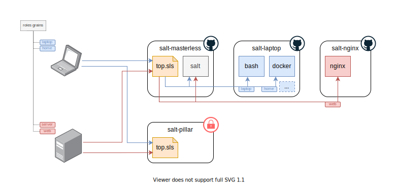

# salt-masterless
Saltstack top file and states for my masterless setup.

## Bootstrap a masterless machine

```bash
curl https://github.com/ralex/salt-masterless/bootstrap.sh -o bootstrap.sh
chmod +x bootstrap.sh
./bootstrap.sh
```

## Documentation

|Repository|Content|
|---|---|
|`salt-masterless`|(This repository) Contains states to manage a masterless setup|
|[`salt-latop`](https://github.com/ralex/salt-laptop)| Provides states for a work station setup|




*`salt-pillar` is a private git repository as it may contain sensitive informations.*
